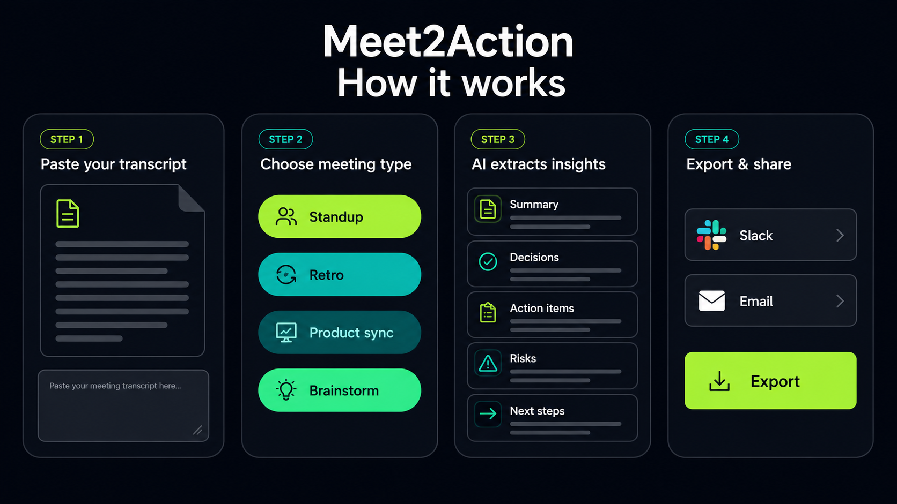
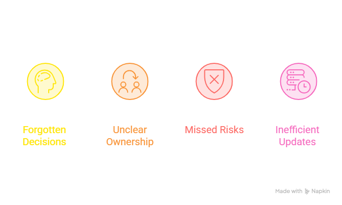

# Meet2Action

Meet2Action is an AI‑powered meeting intelligence tool that turns messy PM meeting notes and transcripts into clear, accountable action plans in seconds. It is fully instrumented with Novus so product teams can see how real users move through the flow and where they get stuck.
- **Demo URL:** https://meet-2-action--rajumokara7.replit.app/




---

## 🔍 Problem

Product Managers and team leads run back‑to‑back meetings, but their notes often stay as scattered bullets in docs, Notion, or chat. That creates real pain:

- Decisions are forgotten or buried.
- Owners and next steps are unclear.
- Important risks never make it into the backlog.
- Weekly updates require re-reading raw notes.

Most “AI meeting tools” stop at generic summaries. They don’t give a structured, execution‑ready view that PMs can immediately paste into Slack, email, or tickets.




---

## ✅ Solution – Meet2Action

Meet2Action converts raw meeting text into a structured, PM‑friendly execution brief:

- **Summary** – One clear narrative of what happened.
- **Key decisions** – What was actually decided.
- **Action items & owners** – Who is doing what, and by when (if mentioned).
- **Risks & open questions** – What might block progress and what’s unresolved.
- **Suggested next steps** – Concrete follow‑ups to keep momentum.

On top of that, Meet2Action:

- Lets you **save and revisit past meetings** with title, type, date/time, and favorites.
- Provides **search and filters** so you can quickly find relevant meetings.
- Offers **copy buttons** (“Copy summary”, “Copy action items”, “Copy full report”) to paste into Slack, email, or docs.
- Is **Novus‑ready** so you can see real user behavior and improve the product over time.

---

## 🎯 Target users

Meet2Action is built for:

- Product Managers and Product Leads.
- Startup founders and team leads.
- Anyone who attends frequent meetings and needs clear, accountable follow‑ups.

Typical use cases:

- Product syncs and roadmap reviews.
- Sprint planning and retros.
- Customer calls and discovery interviews.
- Stakeholder alignment meetings.

---

## 🧱 Tech stack

**Frontend**

- React + TypeScript
- Tailwind CSS
- Simple card‑based dashboard layout inspired by Novus

**Backend**

- Node/TypeScript (Replit server)
- LLM provider (e.g., OpenAI / Gemini) for:
  - Structured extraction (summary, decisions, actions, risks, next steps)
  - Follow‑up Q&A (“Ask about this meeting” tab)

**Data & Storage**

- Lightweight database (Replit DB or equivalent) for meeting history:
  - `id, title, meetingType, createdAt, summarySnippet, transcript, isFavorite, source`

**Analytics**

- **Novus.ai** installed as the product agent:
  - Auto‑instrumentation for pages and events.
  - Dashboard to see signals, flows, and replays.

**Deployment**

- Primary: Replit deployment  
- Optional: Vercel (Next.js/React build) for a future dedicated production URL.

---

## 🧩 Project structure (example)

```text
root
├─ artifacts/
│  └─ meet2action/
│     ├─ index.html          # Base HTML shell
│     └─ src/
│        ├─ main.tsx         # React entry
│        ├─ App.tsx          # App shell and routing
│        ├─ components/
│        │  ├─ Landing.tsx
│        │  ├─ ProfileSetup.tsx
│        │  ├─ MeetingForm.tsx
│        │  ├─ MeetingTabs.tsx
│        │  ├─ HistoryPanel.tsx
│        │  └─ CopyButtons.tsx
│        ├─ hooks/
│        │  └─ useMeetings.ts
│        └─ lib/
│           └─ api.ts        # Calls to backend / LLM
├─ server/
│  └─ index.ts               # API routes (analyze, history, etc.)
└─ README.md
```

*(Adjust names to match your actual repo.)*

---

## 🧭 Key flows

1. **Landing → profile → app**
   - User lands on a simple page explaining Meet2Action and clicks “Get started”.
   - Optional lightweight profile: name, email, avatar, or continue anonymously.
   - App greets the user by name or as “Anonymous PM”.

2. **Add a new meeting**
   - Enter meeting title.
   - Paste meeting notes or upload `.txt` / `.md`.
   - Select meeting type (e.g., standup, product sync, customer call, or “Other”).
   - Optional hint for audio:  
     > Have an audio file? Use your favorite transcription tool (e.g., your calendar’s auto‑transcription, Zoom, or a speech‑to‑text tool) and paste the transcript here.
   - Click **“Extract actions”** or use the sample meeting button.

3. **View structured analysis**
   - **Tab 1 – Summary**: Summary, key decisions, action items & owners, risks/open questions, suggested next steps.
   - **Tab 2 – Transcript**: Raw meeting transcript for reference.
   - **Tab 3 – Ask**: Q&A about this meeting (e.g., “What did Ravi say?”, “What are the key risks?”).

4. **Share**
   - Buttons: **Copy summary**, **Copy action items**, **Copy full report**.
   - Toast: “Copied! Paste into Slack, email, or docs.”

5. **Past meetings**
   - List of meetings with search, date filter, meeting type filter, and favorites.
   - Click a row to open the meeting detail; use back link to return to the list.
   - Ability to delete a meeting with a confirmation dialog.

---

## 🏠 Local setup

```bash
# 1. Clone the repo
git clone https://github.com/rajum37/meet2action.git
cd meet2action

# 2. Install dependencies
npm install

# 3. Set environment variables
# Create a .env file with your LLM API key and any other secrets:
# OPENAI_API_KEY=...
# or GEMINI_API_KEY=...

# 4. Run the dev server
npm run dev

# 5. Open the app
# Usually http://localhost:5173 or as printed in the console
```

---

## 🚀 Deploying to Vercel

1. Push your repo to GitHub.  
2. Go to [Vercel](https://vercel.com), click **New Project**, and import the repo.  
3. Set build command (e.g., `npm run build`) and output folder (e.g., `dist`).  
4. Add env vars (LLM API keys, etc.) in Vercel’s dashboard.  
5. Deploy and use the generated URL as your **production link**.

For the hackathon, your main public URL is currently:

- **Live app:** https://meet-2-action--rajumokara7.replit.app/

---

## ✅ Submission checklist (World Product Day: Everyone Ships Now)

- [x] New, original project created for this hackathon. [web:31]  
- [x] Public working app URL (Replit).  
- [x] Short demo video (2–3 minutes) showing:
  - Landing → Add meeting → Extract actions → Copy to Slack/email.
  - Brief look at Novus dashboard.
- [x] Written project story on Devpost.
- [x] Novus installed and sending data:
  - Pendo/Novus snippet in `index.html`.
  - `pendo.initialize()` and `pendo.identify()` hooked into profile setup.  
- [x] Novus proof (dashboard screenshot attached in Devpost).  
- [x] Repository link (GitHub) included in “Try it out”.

---

## 📊 Novus.ai integration

Meet2Action is fully instrumented with **Novus**, the product agent from Pendo:

- The Novus/Pendo SDK is installed in the `<head>` and initialized on app boot. [file:57]  
- `pendo.identify()` runs after the profile setup step to attach visitor metadata (id, email, full name, timestamps). [file:57]  
- Novus’s dashboard shows:
  - Your codebase mapped and ready for signals.
  - Memory for Meet2Action: product overview, personas, product areas, key flows, integrations, documentation. [file:58][file:59]  
- As real users interact with Meet2Action, Novus will generate signals and replays to show where they get stuck and which flows matter most.

Screenshot examples to include in Devpost:
- Novus dashboard (“Your codebase is mapped. Almost live.”). [file:60]  
- Novus Memory page for Meet2Action (product overview). [file:58]

---

## 🧠 What I learned & future work

- How to design a narrow, high‑value PM workflow around meetings rather than a generic “AI notes” app.
- How to integrate Novus as a product agent to instrument a new app from day one.
- How to keep scope tight while still adding features that make it feel like a real tool: history, filters, copy actions, and Q&A.

Next steps:

After the hackathon, we want to:

- Use Novus signals and replays to iteratively refine the UX – for example, simplifying the first‑run experience if we see users hesitate on meeting type or copy actions.
- Add direct integrations (Slack, email, Jira/Linear) so PMs can send summaries and action items with a single click instead of copy‑paste.
- Introduce team workspaces with shared history, permissions, and more advanced filters (by team, initiative, or project).
- Add optional user authentication so PMs can access their meetings from any device while keeping the hackathon version frictionless with “continue anonymously”.
- Support audio uploads by integrating a speech‑to‑text API, so users can drop in recorded meetings and let Meet2Action handle transcription plus analysis end‑to‑end.
- Expand the “Ask” tab into a richer chat assistant for each meeting, capable of answering deep follow‑up questions like “What did Ravi commit to?”, “What are the risks for launch?”, or “Summarize this for an executive update”.

---


- **Live app:** [https://meet-2-action--rajumokara7.replit.app](https://meet-2-action--rajumokara7.replit.app)  
- **GitHub repo:** [https://github.com/rajum37/meet2action](https://github.com/rajum37/meet2action)
